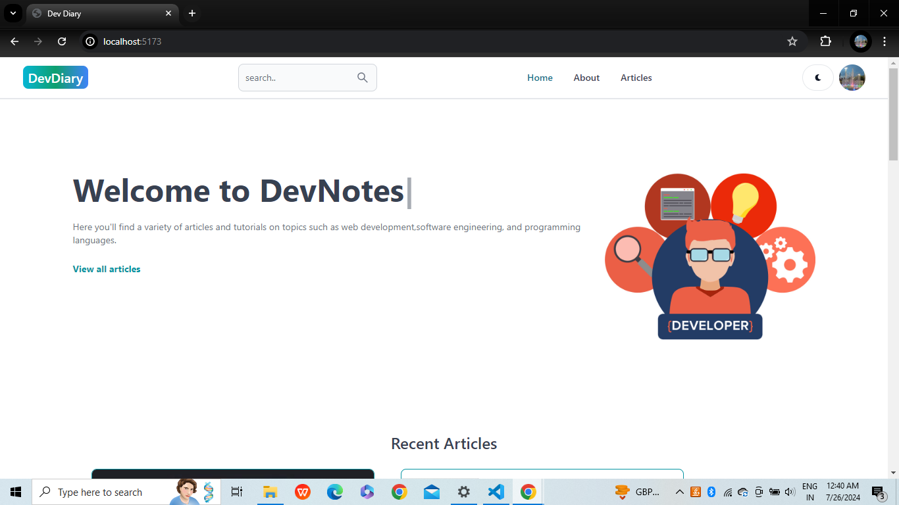
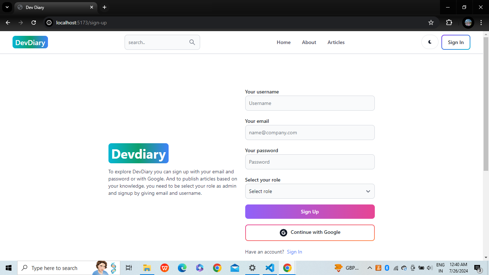
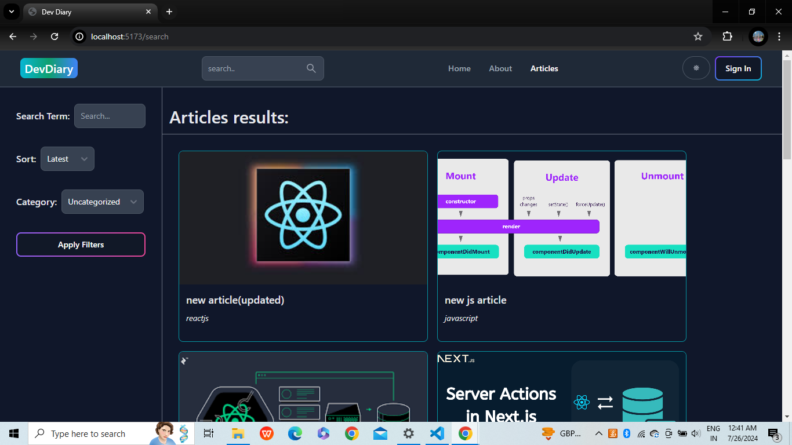
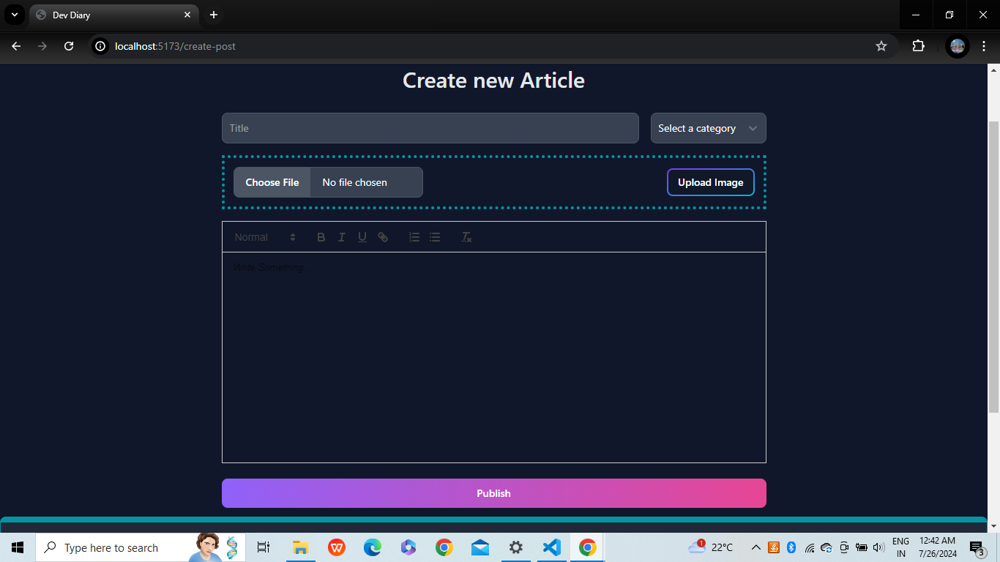
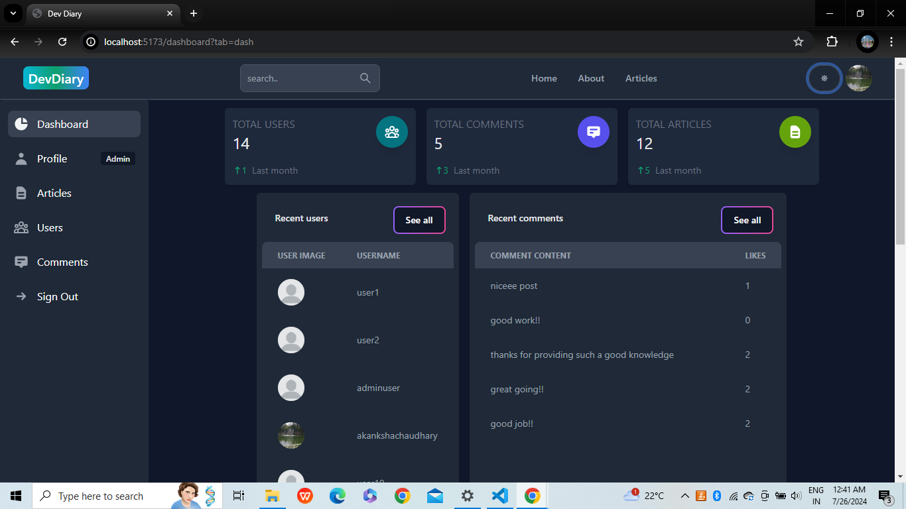

# DevDiary
Welcome to DevDiary, an innovative MERN full stack application designed to empower developers by providing a platform to share their knowledge through insightful articles and detailed notes. Whether you're documenting your coding journey or seeking to learn from others, DevDiary offers a user-friendly interface, robust backend, and secure, real-time data synchronization, fostering a dynamic community of continuous learning and collaboration among developers.

## Features
- User-friendly interface with React
- State management with Redux Toolkit
- Robust backend with Node.js and Express
- Flexible NoSQL database with MongoDB
- Secure authentication and real-time synchronization with Firebase
- Rich text editor for creating detailed articles and notes
- Tagging and categorization for organized content
- Community interaction through comments and follows

## Technologies Used
- **React**: For building the user interface
- **Redux Toolkit**: For state management
- **Node.js**: For the server-side runtime environment
- **Express**: For the backend framework
- **MongoDB**: For the database
- **Firebase**: For authentication and real-time data synchronization

## Screenshots
### Home Page


## Signup


## Articles


## Create Article


## Dashboard


## Installation
To run this project locally, follow these steps:

1. **Clone the repository:**
    ```bash
    git clone https://github.com/your-username/devdiary.git
    cd devdiary
    ```

2. **Install server dependencies:**
    ```bash
    cd server
    npm install
    ```

3. **Install client dependencies:**
    ```bash
    cd ../client
    npm install
    ```

4. **Set up Firebase:**
    - Create a Firebase project and add a web app to it.
    - Obtain your Firebase configuration and add it to your client-side environment variables.

5. **Create a `.env` file in the `server` directory with the following:**
    ```env
    MONGO_URI=your_mongodb_uri
    FIREBASE_API_KEY=your_firebase_api_key
    FIREBASE_AUTH_DOMAIN=your_firebase_auth_domain
    FIREBASE_PROJECT_ID=your_firebase_project_id
    ```

6. **Run the development server:**
    ```bash
    cd ../server
    npm run dev
    ```

7. **Run the client:**
    ```bash
    cd ../client
    npm start
    ```

## Usage
Once the application is running, you can create an account, log in, and start creating articles and notes. You can also explore content created by other developers and leave comments.

